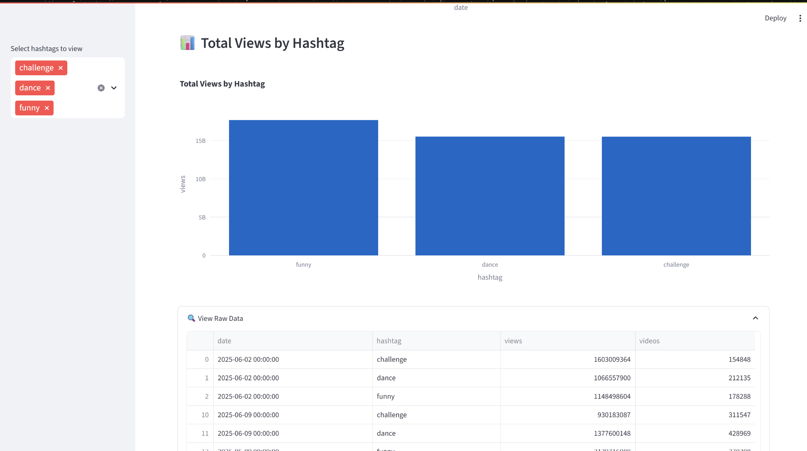
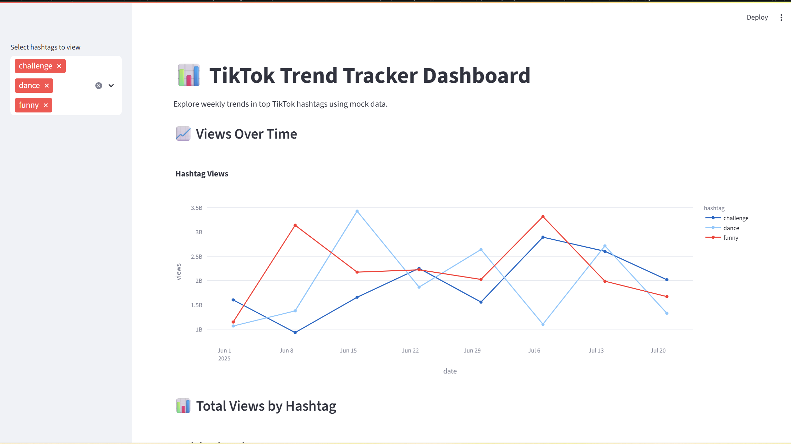

# TikTok Trend Tracker Dashboard 📈

This project analyzes trending TikTok hashtags over an 8-week period using mock data. It includes visualizations of hashtag performance (views and video counts) over time and is designed as a beginner-friendly data science portfolio project.

## 🔍 Project Goals

- Practice working with time-series and categorical data
- Build visual insights using Matplotlib and Seaborn
- Simulate real-world data exploration for social media analytics

## 🗃️ Dataset

Mock dataset includes:
- 10 popular TikTok hashtags (e.g., `#challenge`, `#dance`, `#funny`)
- Weekly data for 8 weeks
- Metrics: total views and video counts

📁 [View dataset](../data/tiktok_trend_mock_data.csv)

## 📊 Notebook

The notebook includes:
- Data generation and preprocessing
- Grouped and time-series visualizations
- Insights into the most engaging hashtags

📓 [View the notebook](data/explore_trends.ipynb)

## 🖼️ Preview

### 📈 Views Over Time

### 📊 Total Views by Hashtag

## 🛠️ Tools & Technologies

- Python
- Pandas
- Matplotlib & Seaborn
- Jupyter Notebook

## 🚀 Future Ideas

- Build a Streamlit dashboard for interactive viewing
- Integrate real TikTok data via APIs
- Compare hashtag trends across different content categories

